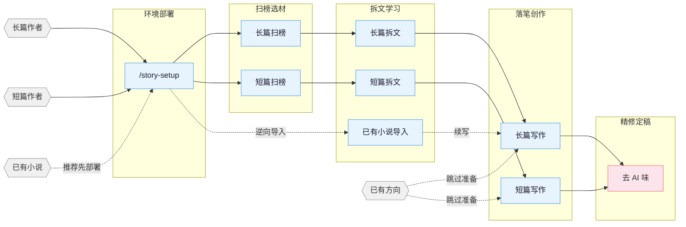

[English](README_EN.md) | **中文**

# oh-story

网文写作 skill 包，覆盖长篇与短篇网络小说的扫榜、拆文、写作、去AI味、封面图全流程。内置适配 Claude Code、OpenCode、ZCode、OpenClaw、Codex CLI、Reasonix、workbuddy；能读取项目文件的 Web AI / Agent 环境也可按通用 skills 路径使用。

> **独立仓库与发行线**：本仓库是 oh-story 的现役独立产品仓库和发行线，不属于 GitHub Fork 网络，也不会自动同步任何外部仓库。后续功能、版本、Dev/Release 渠道及商业化由本项目独立规划和维护。早期代码基于 MIT 开源版本演进；完整 Git 历史用于持续记录代码来源与贡献归属，具体许可见 [`LICENSE`](LICENSE)。
>
> 本 README 只介绍本仓库能力与本仓库案例，不混入第三方演示项目。自研改动来自真实写作复盘——长篇《[财阀除名那晚，古井给我递了药方](https://fanqienovel.com/page/7661645008545516606)》（番茄小说连载中，星河上人 著）与多篇番茄短故事全流程落地：把实战中踩过的坑改回工具本身，而不是每次靠人工记住。

### 自研升级清单（按实战复盘沉淀）

- **错别字校验前置门**：新增 `check-typos.js`，作为每章写完落盘后的第一道检查（先于AI味/退化/标点脚本）——源自真实漏检案例（"那笔钱"误写"那笔欠"被读者发现），高置信度固定搭配词典，advisory级从不自动改写
- **实战验证的题材包**：新增 `现实共鸣型`（原生家庭剥削/职场PUA反杀/彩礼陷阱）与 `悬疑脑洞型`（死亡游戏/规则怪谈，含创作五步法与真规则原则）两个题材包——基于番茄作家后台真实热门故事榜与两轮独立爆款语料交叉验证后补齐的覆盖缺口，并已用于实际成稿
- **反转规则消歧**："一个反转撑一篇"改写为"一个核心反转撑骨架，高频小反转做肌肉"——用真实爆款语料（约每800-1500字一次小翻转）修正了易被误读的执行规则

- **Phase 5 质检步骤硬性化**：一致性检查、去AI味独立审查从"如果部署了可以 spawn"改成硬性必须项，不再因软性措辞被连续多章静默跳过
- **逐章质检进度表**：新增 `追踪/质检进度.md`，机械可查每章各项检查有没有跑过，不用翻叙述性日志找答案
- **伏笔状态列动态定位**：`detect-story-gaps.sh` 不再硬编码列号，改为运行时读表头动态定位"状态"列，修复了协议模板、真实项目、测试夹具三种不同表格列序下的误判
- **对话密度确定性统计**：`check-ai-patterns.js` 新增 info 级别的对话密度输出，不用每次手写脚本现算
- **独角戏对话密度补救技法**：`dialogue-mastery.md` 补充电话转对话、对信物自语转独立引号句两个可复用技法
- **双 POV 接力钩子措辞红线**：细纲模板补充说明，避免"他/她不知道的是……"式提示被字面照抄进正文而违反去AI味硬规则
- **发布前格式化导出**：新增 `export-for-platform.js`，只做标题+正文分离的纯文本导出，不碰登录/发布

## 核心思路

> **套路 = 确定性的情绪满足**

专业作者的方法论三步走：

1. **扫榜**：分析热门榜单，洞察题材、人设、切入点。
2. **拆文**：拆解大纲节奏与剧情素材，建立个人模块库。
3. **商业化写作**：学习并运用钩子、爽感、期待感等核心技巧。

围绕四条线展开：爆款逆向 · 剧情模块化重组 · 上下文状态分层管理 · 人机协同。

> v0.7.10 起：修复“中文小说写着写着切成英文”。工具链新增三层门：生成前把普通中文长短篇锁定为 `zh`；交付前深扫纯英文句段、连续英文片段和裸小写英文词，同时保护 URL、邮箱、代码、路径、型号等合法内容，并复用 `.deslop-whitelist`；落盘后由多端 Hook 复查，长篇写下一章前再拦上一章英文旧债。命中 blocking 必须返修并复扫。`agents_version` 升至 29，已部署项目需重跑 `/story-setup` 并新开会话。
>
> v0.7.9 起：开始把上游尚未实现的已知问题做成本仓库的领先能力。新部署项目的普通长篇写作缺追踪 state 时由 Claude 正文守卫 fail-closed，旧部署仍兼容，已有拆文库的受控 `story-import` 迁移窗口保留；chapter-extractor 新任务优先走严格 JSON 校验与确定性 Markdown 渲染；去 AI 味新增“感官对象误作感知主体” advisory；长短篇采集报告统一复用单一 run clock，同时标明 UTC 抓取时刻和本地文件日期。`agents_version` 升至 28，已部署项目需重跑 `/story-setup` 并新开会话。
>
> v0.7.8 起：逐项吸收原上游 3174916 / fcec86e 的增量，不覆盖本仓库自研能力。Bash 重定向与 `tee/touch/cp/mv/install` 写正文也进入细纲前置守卫，书目录发现统一 4 层并补 symlink 防逃逸；七猫增加日/月榜周期，起点补字数/总推荐/签约/收费字段；Stage 6 固定复用 `_progress.md` 章节边界，跨批审查落盘未解决 findings；chapter-extractor 增加事前格式约束，500+ 章改走 10-20 章子 Agent 批次和降维合并；写作侧补齐普通名词引号强调规则。`agents_version` 升至 27，已部署项目需重跑 `/story-setup` 并新开会话。
>
> v0.7.7 起：选择性吸收原上游的写作指令精炼——`story-deslop` 删除会诱导电报体的「1-3 句/段」固定基准，改按 beat 调节段落疏密并补句内节奏；`narrative-writer` 与共享去 AI 味参考去重，保留本仓库的情绪下限、错别字、规划记号泄漏、留存和连续性守卫；长篇开书 Phase 1-3 拆为按需参考，日更不再反复加载整套选题/设定/大纲流程。`agents_version` 升至 26，已部署项目需重跑 `/story-setup` 并新开会话。
>
> v0.7.5 起：三类确定性闸口落地——**跨章连续性守卫**（位置/持有物进热上下文，改动必须逐字报出旧值才放行，堵住「上一章住宿舍、下一章骑车从家出发」这类硬伤）、**规划记号泄漏拦截**（`ch13`、`watcher` 这类临时代号进自动 hook 网，不依赖模型自觉）、**情绪与钩子下限**（此前 84 条规则全是禁止型，零情绪也能通关）。同时恢复「第 1 章必须强」「正文章至少 2 级」两项基础约束。`agents_version` 升至 24，已部署项目需重跑 `/story-setup` 并新开会话。
>
> v0.7.3 起：修复跨端拆文的降级路径——ZCode / OpenClaw / Reasonix / 通用 Web AI 四端不部署 project agents，拆文必然走串行降级，而降级说明此前指向一份这四端读不到的 `chapter-extractor.md`，属循环依赖；现改指 skill 自带的 `output-templates.md`。章节概要改叙事化、原文引用改精选，新增 P 行白描硬检查。Dashboard 目录树改按需加载，并修复标准短篇工程（单文件 `正文.md` 结构）不被识别；写作项目与拆文库的扫描预算相互隔离。另修复更新检查链路（旧仓库名导致 API 301、curl 未跟重定向，提醒从未生效）。`agents_version` 21 → 22，**已部署项目需重新运行 `/story-setup` 并新开会话**。
>
> v0.7.2 起：正文默认恢复自然逗号长句，治理“短句越多越网文”的电报体误区；细纲只规定事件与约束，不把五段式机械复刻成五段正文；章尾要求落在人物动作、画面或台词上，并新增总结式预告结尾检测。每章继续执行“收一个、变一个、开一个”，但硬反转、硬悬念和爆点按结构节点分配。新增 `/story dashboard` 本地工作台，测试仅使用中性夹具，不包含第三方小说 demo。已部署项目需重新运行 `/story-setup` 并新开会话。
>
> v0.7.0 起：多端适配再扩两家——ZCode 3.3.4 原生适配（仓库作 marketplace/plugin 安装，`story-setup target_cli=zcode`）与 Reasonix Phase 1（skills + 原生 plugin manifest）；hook 核统一到共享 node 核并加六端 parity 锁；长篇把「剧情条/循环卡/…」五个叫法统一为「剧情单元」并把拆书产物接入卷纲/细纲；去 AI 味闸口机器化——写后正文网自动扫描确定性毒句式，写下一章前新增「毒句式欠账门」（无状态、node 缺失放行、可用 `<!-- 去味:跳过 -->` 显式豁免）。已部署项目需重新运行 `/story-setup` 并新开会话。
>
> v0.6.22 起：长篇正文接入「题材正文提示卡」——32 个番茄题材的腔调卡在写作时按题材召回进写手（卡内容绝不入正文），并配套大纲边界与逐章写法公式防越界注水；短篇新增投稿层 `submission-craft`（知乎盐选/小程序/番茄三路平台基调、导语门面打磨、付费点断点设计）；全套件 skill 文档去重瘦身约 33KB；story-setup 支持 generic Web AI 部署。已部署项目需重新运行 `/story-setup` 并新开会话。
>
> v0.6.24-fork 起：基于 TikHub 知乎接口的二轮爆款语料实证——`story-short-write` 执行规则"一个反转撑一篇"改写为"一个核心反转撑骨架，高频小反转做肌肉"（消除歧义）；`悬疑脑洞型` 题材包补入规则怪谈"创作五步法"生成方法与"真规则原则"。
>
> v0.6.23-fork 起：`story-short-write` 新增两个题材风格包——`现实共鸣型`（原生家庭剥削/职场PUA反杀/彩礼陷阱）与 `悬疑脑洞型`（死亡游戏/规则怪谈），核心题材由4个扩到6个；两包均标注真实来源与证据强度，明确区分于追妻火葬场型的情绪基调（清醒反制/冷峻推理，非虐恋宣泄）。
>
> v0.6.22-fork 起：`story-long-write` Phase 5 新增 `check-typos.js` 错别字校验脚本，作为本批正文写完落盘后的第一个检查步骤（先于 AI 味/退化/标点脚本），收录高置信度固定搭配错字词典，所有命中均为 advisory、脚本从不自动改写；`质检进度.md` 模板同步新增对应列。
> v0.6.21 起：短篇写作参考栈瘦身——`story-short-write` 删除长篇继承残留 references，改由 `short-format` / `short-craft` / `short-deslop` + 四个题材包（追妻火葬场、复仇打脸、总裁豪门、宅斗宫斗）承接短篇格式、情绪直给、节奏密度和去 AI 味；已部署项目建议重新运行 `/story-setup` 并新开会话，获取新版 narrative-writer 短篇例外。
>
> 更早版本变更见 [CHANGELOG.md](CHANGELOG.md)。

## 流程总览



## 安装

**方式一** 直接告诉 Claude Code / OpenCode / ZCode / OpenClaw / Codex，或其他支持导入 skill 压缩包的 Web AI / Agent 平台：

```
安装这个 skill https://github.com/qin1473692580-ux/oh-story-claudecode/releases/latest/download/oh-story-release.zip
```

**方式二** 命令行：

```bash
npx skills add https://github.com/qin1473692580-ux/oh-story-claudecode/releases/latest/download/oh-story-release.zip -y -g
```

`-g` 全局安装，所有目录可用；去掉 `-g` 则只装到当前目录。更新时重新执行同一条命令即可。该 URL 始终指向最新的正式 GitHub Release 资产，不会把浮动的 `main` 开发态安装到用户环境。


> **Codex 开发者（dev-only）：** 仅在参与本仓库开发、需要验证未发布的 `main` 时才 repo 内直接使用：Codex 会扫描 `$REPO_ROOT/.agents/skills`（指向 `skills/` 的 symlink）发现 16 个 skill；用 `$story`、`$story-setup` 或 `/skills` 调用。这不是正式安装/更新路径。Windows 上 git 需开 `core.symlinks=true`，否则 symlink 失效，改用上方 Release 压缩包安装。
> 跑 `$story-setup` 部署到写作项目后，会写入 `.codex/agents/*.toml`、`.codex/hooks.json`、`.codex/hooks/{story_codex_hook.py,run-story-hook.sh,run-story-hook.cmd}` 和 `.codex/skills/story-setup/references/agent-references/`；请信任项目 `.codex/` 配置层并在 `/hooks` review/trust hooks、新开 Codex 会话，让 custom agents 生效。
>
> **ZCode 用户：** 稳定版先用上方 Release 压缩包安装；把浮动仓库加入 Plugin Management marketplace 仅用于开发测试（dev-only）。安装后可用 `$story`、`$story-setup` 或 `/` 面板调用 16 个 Skills/Commands。`$story-setup` 选择 `target_cli=zcode` 会部署 `.zcode/skills/`、`.zcode/commands/`、`.zcode/hooks/story_zcode_hook.js`，安全合并 `.zcode/config.json` 与根 `AGENTS.md`；Hook 依赖 PATH 中的 `node`。ZCode 3.3.4 不执行项目/plugin custom agents，也没有 `PreCompact` / `SessionEnd`，相关流程会明确降级 solo/direct，compact 后由 `SessionStart` 恢复上下文。
>
> **OpenCode 用户：** 全局安装后 opencode 自动从 `~/.claude/skills/` 发现 skills；首次用自然语言触发 story-setup（如「用 story-setup 部署网文写作环境」），**部署后退出重进 `opencode -c`** 才能用 slash command。部分 hook 行为与 Claude Code 有差异（session-start / session-end / compact 等），详见 [CONTRIBUTING.md](CONTRIBUTING.md) 的 OpenCode 章节。
>
> **OpenClaw 用户：** 当前支持 skills-only：OpenClaw 可从 workspace `skills/`、`.agents/skills`、`~/.agents/skills`、`~/.openclaw/skills` 等 skill root 发现本项目 16 个 skill；`SKILL.md` 已按 OpenClaw 要求使用单行 `name` / `description` 与单行 JSON `metadata.openclaw`。`story-setup` 选择 `target_cli=openclaw` 时会把 skills 复制到项目 `skills/` 并写入 OpenClaw 版 `AGENTS.md`；agents/hooks 暂不部署，写正文前大纲守卫在 OpenClaw 下是 skill 内软约束。部署后如未显示新 skills，请新开 OpenClaw session 或等待 watcher 刷新。
>
> **Reasonix 用户：** 当前支持 skills + 原生 plugin manifest（Phase 1）：Reasonix 原生扫描 `.agents/skills`（指向 `skills/` 的 symlink）发现 16 个 skill，用 `reasonix doctor capabilities` 校验；也可用根 `reasonix-plugin.json` 走 `reasonix plugin install`。项目级 `story-setup` 部署与 hooks 是后续阶段。Windows 未启用 symlink 时改走原生 plugin。
>
> **Web AI / 通用 Agent 用户：** 下载并解压上方 Release 资产后，可让 Agent 读取其中 `skills/*/SKILL.md` 与对应 `references/`；直读浮动 GitHub 仓库仅限 dev-only 测试。需要项目内副本时，`story-setup` 可选 `target_cli=generic`，只写通用 `AGENTS.md` 和 `skills/`。无本项目 hooks/custom agents 的环境按 skill 内软约束或 solo/direct fallback 执行。
>
> 升级后如果项目里已经跑过 `/story-setup`，建议在项目根重跑一次 `/story-setup`，同步 hooks / agents / references。每版变更见 [CHANGELOG.md](CHANGELOG.md) 与 [Releases](https://github.com/qin1473692580-ux/oh-story-claudecode/releases)；发版流程见 [RELEASING.md](RELEASING.md)。

> **多 agent 协作要先部署再新开会话**：7 个专业 agent（story-architect、narrative-writer、consistency-checker 等）由 `/story-setup` 写入项目 `.claude/agents/`，或由 `$story-setup` 写入 `.codex/agents/*.toml`。Claude Code / Codex 都在会话启动时更稳定地注册 custom agent；ZCode 3.3.4、OpenClaw Phase 1、Reasonix Phase 1 与 generic 路径默认走 skills + solo fallback。判断是否生效：新会话里跑 `/story-review`，报告头是 `Effective Mode: full/lean` 即注册成功，是 `Fallback: ... -> solo` 说明当前运行时未暴露该 agent。

> **导入续写顺序：** 推荐先在写作项目根运行 `/story-setup`（部署 hooks/agents/AGENTS），新开/刷新会话后运行 `/story-import` 导入已有小说，再用 `/story-long-write 日更` 或 `/story-long-write 写第N章` 续写。也可以直接运行 `/story-import`；它会先检测是否已 setup，未部署时让你选择先去 setup 或继续串行导入。

## 本地写作工作台

在项目根运行 `/story dashboard`（Codex 用 `$story dashboard`），即可启动只监听 `127.0.0.1` 的本地工作台，浏览拆文库和写作项目、搜索文件，并安全编辑白名单文本格式。保存采用版本校验，删除需要确认；工作台不会自动暴露到局域网或公网。

Dashboard 的自动化测试使用仓库内即时生成的中性夹具，不依赖、复制或展示任何第三方小说案例。

## Skills

| Skill | 触发 | 说明 |
|:------|:-----|:-----|
| `story-setup` | `/story-setup` `$story-setup` `/准备写书` | 环境部署 · Claude/OpenCode/Codex/ZCode/OpenClaw + generic（已有配置安全合并） |
| `story` | `/story` `$story` `/网文` | 工具箱路由 · 自动分发对应 skill，并可启动本地 Dashboard |
| `story-long-write` | `/story-long-write` `/写长篇` | 长篇写作 · 大纲搭建、人物设定、正文输出 |
| `story-long-analyze` | `/story-long-analyze` | 长篇拆文 · 黄金三章、爽点设计、节奏分析 |
| `story-long-scan` | `/story-long-scan` | 长篇扫榜 · 起点/番茄/晋江市场趋势 |
| `story-short-write` | `/story-short-write` | 短篇写作 · 情绪设计、反转构思、精修出稿 |
| `story-short-analyze` | `/story-short-analyze` | 短篇拆文 · 故事核、结构分析、情感线、反转设计、写作手法、共鸣分析 |
| `story-short-scan` | `/story-short-scan` | 短篇扫榜 · 知乎盐言/番茄短篇风口数据 |
| `story-deslop` | `/story-deslop` `/去AI味` | 去AI味 · 检测并清除 AI 写作痕迹 |
| `story-import` | `/story-import` `/导入小说` | 逆向导入 · 将已有小说反向解析为标准项目结构 |
| `story-review` | `/story-review` `/审查` | 多视角审查 · 4 Agent 多视角审稿 + 番茄/起点/知乎评分标准 |
| `story-grill` | `/story-grill` `/采访` | 采访式定稿 · 设定/卷纲/细纲一次一题逐项拍板，断点续采 |
| `story-drama-write` | `/story-drama-write` `/写剧本` | 短剧剧本 · 不写小说直接出剧本（横 16:9／竖 9:16），立项与分集纲采访拍板 |
| `story-cover` | `/story-cover` `/封面` | 封面生成 · 书名题材分析 + GPT-Image-2 出图 |
| `browser-cdp` | `/browser-cdp` | 浏览器操控 · CDP 协议复用登录态抓取数据 |

> `story-deslop` 的本地检查是写作 lint：blocking 只限确定性句式/标点问题，其他提示按读感判断；朱雀等外部检测只作自测参考，不替代人工读感。

自然语言同样触发：
- 「帮我开书」→ `story-long-write`
- 「这篇太 AI 了」→ `story-deslop`
- 「把我的书导进来」→ `story-import`
- 「设定一点一点定」→ `story-grill`
- 「我要写短剧剧本，不写小说」→ `story-drama-write`
- 「林晚现在什么状态」→ 自动 spawn `story-explorer` agent

## Agent 体系

写作 skill 内部通过 7 个专业 Agent 协作，各司其职：

| Agent | 模型 | 职责 |
|:------|:-----|:-----|
| **story-architect** | Opus | 故事架构 · 题材定位、大纲结构、钩子/反转设计、情绪弧线 |
| **character-designer** | Sonnet | 角色设计 · 角色档案、语言风格、动机链、对话创作 |
| **narrative-writer** | Sonnet | 叙事写手 · 正文写作、去AI味、格式合规 |
| **consistency-checker** | Haiku | 一致性检查 · 事实冲突扫描、伏笔追踪、S1-S4 分级报告 |
| **story-researcher** | Sonnet | 资料研究 · CDP 搜索+正文提取、多源交叉验证、结构化参考文件输出 |
| **story-explorer** | Haiku | 故事查询 · 角色/伏笔/设定/进度只读查询，日更上下文快速加载 |
| **chapter-extractor** | Haiku | 章节提取 · 摘要+情节点+角色提及，并行拆文核心单元 |

Agent 按需加载 `references/` 中的写作理论（角色设计、对话技法、反转工具箱等 100+ 份方法论文件），不预占上下文。

## 自动化 Hooks

Claude Code 项目经 `/story-setup` 部署后会启用下列 8 个 shell hook；其他适配器按各自支持的事件模型复用同一套守卫逻辑：

| Hook | 触发时机 | 功能 |
|:-----|:---------|:-----|
| session-start.sh | 会话开始 | 显示分支、进度快照、拆文状态 |
| session-end.sh | 会话结束 | 记录会话日志到 `追踪/session-log.txt` |
| detect-story-gaps.sh | 会话开始 | 检测设定缺口、大纲缺失、伏笔断线 |
| pre-compact.sh | 上下文压缩前 | 保存进度快照路径和行数摘要 |
| post-compact.sh | 上下文压缩后 | 提示读取进度快照恢复上下文 |
| validate-story-commit.sh | git commit 时 | 检查硬编码属性、设定必填字段（仅警告，不阻断） |
| guard-outline-before-prose.sh | 写正文前（Write/Edit） | 缺对应细纲/小节大纲时阻止首次创建正文（阻断），强制先搭大纲 |
| check-prose-after-write.sh | 正文落盘后（PostToolUse: Write/Edit/MultiEdit） | 确定性毒句式/截断/AI自指等硬信号兜底扫描（advisory，不阻断），即 v0.7.0 提到的"毒句式欠账门"机制 |

## 项目文件结构

一部长篇动辄几十万字、几百章。设定冲突、伏笔断线、时间线对不上——写到最后全靠记忆硬撑，迟早翻车。

用文件系统把设定、大纲、正文、追踪拆开，每个维度独立维护。对话只负责创作，不负责记忆。

**长篇：**

```
{书名}/
├── 设定/
│   ├── 世界观/          # 背景、力量体系等，按主题拆文件
│   ├── 角色/            # 每个人物一个文件（林晚.md、周砚.md）
│   ├── 势力/            # 每个势力/组织一个文件（观星司.md）
│   ├── 关系.md          # 角色关系映射
│   └── 题材定位.md      # 题材核心梗+对标分析
├── 大纲/
│   ├── 大纲.md          # 全书卷级结构
│   ├── 卷纲_第一卷.md   # 每卷一个：爽点节奏+情绪弧线+人物弧线+伏笔+反转
│   ├── 细纲_第001章.md  # 每章一个：内容概括+多线情节+人物关系/出场顺序+钩子
│   └── ...
├── 正文/
│   ├── 第001章_章名.md
│   └── ...
├── 对标/                # 对标参考（结构化子目录从拆文库同步）
│   └── {对标书名}/
│       ├── 原文/            # 对标书原文章节
│       ├── 角色/            # 结构化角色卡（从 analyze 输出同步）
│       ├── 剧情/            # 结构化剧情线/节奏/情绪模块（从 analyze 输出同步）
│       ├── 设定/            # 结构化设定（从 analyze 输出同步）
│       ├── 文风.md          # 日更前读取，用来贴近对标书文风
│       └── 拆文报告.md      # analyze skill 输出的拆文报告
├── 追踪/                # 连续性管理（分层追踪）
│   ├── 上下文.md        # 写作上下文（compact 恢复用）
│   ├── 伏笔.md          # 伏笔埋设/回收状态表（跨卷级）
│   ├── 时间线.md        # 故事内时间线（全书级）
│   └── 角色状态.md      # 角色当前状态快照（章节级）
├── 参考资料/            # story-researcher 输出的研究资料
│   └── {topic}.md       # 按研究主题拆分
```

**短篇：**

```
短篇/{标题}/
├── 正文.md              # 完成稿
├── 小节大纲.md          # 8 节结构 + 情绪曲线
└── 拆文库/              # 如有参考小说（analyze 输出）
    └── {书名}/
        ├── 拆文报告.md
        ├── 情节节点.md
        └── 写作手法.md
```

**拆文库：** 拆文 skill 默认输出到项目根目录 `拆文库/{书名}/`，产出结构化目录（角色/剧情/设定/章节），其中长篇剧情目录包含 `节奏.md` 和 `情绪模块.md`，是 analyze 的源数据（source of truth）。写作 skill 通过 `对标/{书名}/剧情/` 等子目录消费这些资产（项目级引用视图），或自动回退读取 `拆文库/`。

**`.active-book`：** 项目根目录的文本文件，内容是当前活跃书目的**相对路径**（如 `长篇/我的小说`），hook 和写作 skill 据此定位当前项目。

## 知识体系

各 skill 自带 `references/` 知识库，按需加载，不占上下文。

<details>
<summary>展开各 skill 知识库主题清单</summary>

| 主题 | 内容 | 所在 skill |
|:-----|:-----|:-----------|
| 大纲排布 | 五步大纲法 · 故事结构分级 · 节点设计法 · 升级感设计 | long-write |
| 开头设计 | 开篇模式 · 前 500 字设计 · 黄金三章开头策略 | long-write / short-write |
| 人物设计 | 角色设定 · 人物提取 · 关系映射 · 动机链 · 群像 | long-write / short-write / short-analyze |
| 钩子技法 | 章尾钩子 13 式 · 章首钩子 7 式 · 段落级钩子 · 悬念编排 | long-write / short-write / short-analyze |
| 情绪设计 | 6 种弧形模板 · 期待感管理 · 题材赛道策略 | long-write / short-write |
| 题材框架 | 长篇八节点 · 短篇压缩三幕 · 12 个短篇题材风格包 | long-write / short-write / short-analyze |
| 对话技法 | 节奏 · 潜台词 · 信息控制 · 对话模式数据库 | long-write / short-write |
| 反转工具箱 | 类型 · 时机 · 误导底层路径 | long-write / short-write |
| 风格模块 | 对话 · 打斗 · 智斗 · 镜头式写作 · 装逼打脸 · 白描 | long-write |
| 高级技法 | 小纲四步法 · 高潮逆推 · 双线结构 · AB 交织法 | long-write |
| 去AI味 | 预防 · 三遍去AI法 · 改写范例库 · 禁用词表 | deslop / long-write / short-write |
| 质量检查 | 通用 · 长篇专项 · 短篇专项 · 毒点排查 | long-write / short-write / short-analyze |
| 写作公式 | 21 大题材写作公式 · 三翻四震 · 感情线四阶段 | short-write / short-analyze |
| 女频写作 | 女读者偏好 · 情感描写 · 感情线模式 · 对标拆书 | short-write |
| 拆文方法 | 黄金三章 · 情绪曲线 · 结构拆解 · 知乎风格分析 | long-analyze / short-analyze |
| 短篇方法论 | 故事核 · 情节节点 · 爆点分析 · 写作手法 · 节奏分析 · 共鸣分析 · 人物分类 · 平台适配 | short-analyze |
| 拆文实例 | 完整案例拆解 · 模板化输出 | short-analyze |
| 读者画像 | 9 维画像 · 目标读者分析 | long-scan |
| 市场数据 | 题材趋势 · 平台特性 · 采集格式 · 投稿指南 | long-scan / short-scan |
| 封面风格 | 10 大题材视觉风格 · 色彩构图 · 提示词模板 | story-cover |
| 多视角审稿 | 多视角审稿 · 评分标准 · 毒点排查 | story-review |

</details>

## 适用平台

**长篇** 起点中文网 · 番茄小说 · 晋江文学城 · 七猫小说 · 刺猬猫

**短篇** 知乎盐言故事 · 番茄短篇 · 七猫短篇

真实产出样例：长篇《[财阀除名那晚，古井给我递了药方](https://fanqienovel.com/page/7661645008545516606)》（番茄小说连载中，星河上人 著，全流程用本仓库的 story-long-write 完成）。

**案例边界：** README 只把本项目直接产出的作品列为产出案例；文末外部链接仅用于必要的技术来源署名，不代表案例采用、合作背书或推荐导流。

这套 skill 的目标是把真实创作中反复踩到的坑沉淀成可复用、可检查的写作流程。

## 知识产权与商业使用

本仓库是独立运营的开源项目。由本项目贡献者创作的新增代码、文档、设计及其他内容，其著作权归相应贡献者或权利人所有。仓库软件依据 [MIT License](LICENSE) 授权；在保留版权声明和许可声明的前提下，个人与组织可以使用、复制、修改、合并、发布、分发、再许可及销售软件副本，也可以将其用于商业产品或服务。

仓库中继承的历史贡献，以及引用或使用的第三方软件、数据、模型、字体、商标和其他材料，权利仍归各自权利人所有，并分别受其许可或使用条款约束。本项目的独立运营不改变这些权利归属，也不表示与相关权利人存在隶属、合作或授权背书关系。

## Star History

<a href="https://www.star-history.com/?repos=qin1473692580-ux%2Foh-story-claudecode&type=date&legend=top-left">
 <picture>
   <source media="(prefers-color-scheme: dark)" srcset="https://api.star-history.com/chart?repos=qin1473692580-ux/oh-story-claudecode&type=date&theme=dark&legend=top-left" />
   <source media="(prefers-color-scheme: light)" srcset="https://api.star-history.com/chart?repos=qin1473692580-ux/oh-story-claudecode&type=date&legend=top-left" />
   
 </picture>
</a>

## 贡献

欢迎通过 [Issues](https://github.com/qin1473692580-ux/oh-story-claudecode/issues) 提交缺陷和需求，也欢迎 Fork 本仓库后提交 Pull Request，贡献新 skill、补充知识库或更新市场数据。详见 [CONTRIBUTING.md](CONTRIBUTING.md)。

## 交流

- **GitHub Discussions**：[提问 / 求助 / 分享用法](https://github.com/qin1473692580-ux/oh-story-claudecode/discussions)，方便检索。
- **微信公众号**：「AI马内」—— 微信搜索关注，后台留言交流。

## 致谢

- [LINUX DO - The New Ideal Community](https://linux.do) — 社区支持
- [FanqieRankTracker](https://github.com/wen1701/FanqieRankTracker) — 番茄小说字体反爬解码方案参考
- [Zhuque AIGC Detector CLI](https://github.com/Sophomoresty/zhuque) — 去 AI 味实验中的外部复测工具参考
