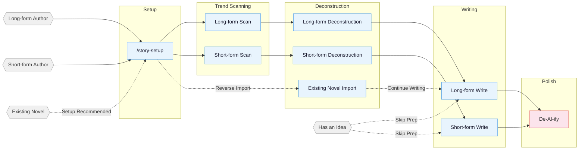

<!-- Last synced with README.md: 2026-08-09 -->

**English** | [中文](README.md)

# oh-story

A web novel writing skill pack with built-in adapters for Claude Code, OpenCode, ZCode, OpenClaw, Codex CLI, Reasonix, and workbuddy. Web AI / agent environments that can read project files can use the generic skills path. Covers the full pipeline for long-form and short-form Chinese web novels: trend scanning, deconstruction, writing, AI tone removal, and cover generation.

> **Independent repository and release line:** This is the active, independently operated product repository and release line for oh-story. It is not part of GitHub's fork network and does not automatically sync from any external repository. Future features, versions, Dev/Release channels, and commercial development are planned and maintained independently. Its early code evolved from MIT-licensed open-source work; the complete Git history preserves source and contribution attribution, and [`LICENSE`](LICENSE) governs distribution and use.
>
> This README documents only this repository's capabilities and its own examples, without importing third-party demo projects. The original enhancements come from end-to-end writing practice on [财阀除名那晚，古井给我递了药方](https://fanqienovel.com/page/7661645008545516606) and multiple Fanqie short stories.

### Independently developed upgrades (distilled from real writing practice)

- **Typo pre-gate**: new `check-typos.js` runs as the very first check after each chapter is saved (ahead of AI-tone/degeneration/punctuation scripts) — born from a real miss caught by a reader; curated high-confidence dictionary, advisory-only, never rewrites.
- **Field-validated genre packs**: new `现实共鸣型` (family-of-origin exploitation / workplace-gaslighting counterattack / bride-price traps) and `悬疑脑洞型` (death games / rule-horror, with a five-step authoring method and the true-rules doctrine) — coverage gaps identified by cross-checking the real 番茄 writer-dashboard hot-story board against two independent hit-story corpora, then used in actual finished stories.
- **Reversal rule disambiguated**: "one reversal per story" rewritten as "one spine-level reversal, high-frequency minor flips as pacing fuel", calibrated against real hit-story corpora (~one minor flip per 800-1500 chars).
- **Phase 5 QA steps are now mandatory**: the consistency-checker and independent AI-tone review used to be worded as "spawn if deployed", which let them get silently skipped across several chapters in a row. Now hard-required.
- **Per-chapter QA progress table**: new `追踪/质检进度.md` makes it mechanically checkable whether each QA sub-step actually ran, instead of scrolling through prose logs.
- **Dynamic foreshadow status-column detection**: `detect-story-gaps.sh` no longer hardcodes a column index — it locates the "status" column from the header row at runtime, fixing false positives across three different real-world table layouts (protocol template, an actual project, and the test fixture).
- **Deterministic dialogue-density stat**: `check-ai-patterns.js` now emits an info-level dialogue-density figure instead of requiring a hand-written script every time.
- **Solo-scene dialogue techniques**: `dialogue-mastery.md` documents two reusable patterns (phone-call-as-dialogue, self-talk-to-object) for chapters with only one character on stage.
- **Dual-POV hook phrasing guardrail**: the outline template now warns that "he/she doesn't know that..." hook phrasing can't be copied verbatim into prose without tripping the anti-AI-tone hard rule.
- **Pre-publish plain-text export**: new `export-for-platform.js` does title/body extraction for copy-paste only — no login, no submission, no credential handling.

## Core Approach

> **Tropes = deterministic emotional payoff**

Professional authors follow a three-step method:

1. **Scan** — analyze trending charts, identify genres, characters, and entry points.
2. **Deconstruct** — break down pacing and plot materials, build a personal module library.
3. **Commercialize** — learn and apply hooks, payoff density, expectation management.

Built around four pillars: reverse-engineering hits · plot modularization · layered state management · human-AI collaboration.

> Starting in v0.7.10: fixes Chinese novels unexpectedly switching into English mid-draft with a three-layer language gate. Chinese long/short-form generation is locked to `zh`; the pre-delivery deep scan blocks full English sentences/paragraphs, English runs, and stray lowercase English tokens while protecting URLs, email, code, paths, and model identifiers and honoring exact `.deslop-whitelist` entries; post-write hooks scan the saved prose, and the long-form preflight blocks the next chapter while the previous chapter still carries English-language debt. Blocking findings must be repaired and rescanned. `agents_version` is now 29; redeploy with `/story-setup` and start a new session.
>
> Starting in v0.7.9: this fork begins shipping verified fixes for known gaps that upstream has not implemented. New deployments fail closed when Claude attempts ordinary long-form writing without tracking state, while legacy deployments and the controlled `story-import` migration window for an existing analysis library remain compatible; new chapter-extractor tasks prefer strict JSON validation plus deterministic Markdown rendering; the prose detector adds an advisory for sensory objects used as perceiving subjects; and all long/short chart scrapers reuse one run clock while exposing both the UTC capture instant and the local filename date. `agents_version` is now 28; redeploy with `/story-setup` and start a new session.
>
> Starting in v0.7.8: selectively ports the upstream 3174916 / fcec86e increments without replacing this repository's custom safeguards. The outline-before-prose guard now covers Bash redirection and `tee/touch/cp/mv/install`, book discovery is bounded to four levels with symlink-escape protection, Qimao gains daily/monthly periods, and Qidian gains word-count/recommendation/signing/pricing fields. Stage 6 reuses `_progress.md` chapter boundaries, batch review persists unresolved findings, chapter-extractor gains pre-output format constraints, and 500+ chapter works use 10-20 chapter sub-agent batches with reduced-result merging. The prose gate also closes the loop on unnecessary quote emphasis around ordinary nouns. `agents_version` is now 27; redeploy with `/story-setup` and start a new session.
>
> Starting in v0.7.7: selectively ports the upstream instruction cleanup without replacing this repository's custom guards. `story-deslop` drops the fixed “1-3 sentences per paragraph” rule that encouraged telegraphic prose, varies paragraph density by beat, and restores sentence-level rhythm guidance. The `narrative-writer` and shared anti-AI references are deduplicated while preserving the local emotion floor, typo, planning-marker leakage, retention, and continuity checks. Long-form setup Phases 1-3 move to an on-demand reference so daily chapter writing no longer loads the full topic/setting/outline workflow. `agents_version` is now 26; redeploy with `/story-setup` and start a new session.
>
> Starting in v0.7.3: fixes the cross-CLI fallback path for chapter analysis. ZCode / OpenClaw / Reasonix / generic Web AI never deploy project agents, so Stage 2 always falls back to serial processing — yet the fallback instructions pointed at a `chapter-extractor.md` those four adapters cannot read, a circular dependency. It now points at `output-templates.md`, which ships inside the skill itself. Chapter summaries become narrative rather than causal-chain lists, source quotes are curated instead of exhaustive, and a mechanical check enforces the plain-description field on every plot point. The Dashboard tree now loads on demand and correctly recognizes standard short-story projects (single-file `正文.md` layout); writing projects and analysis libraries no longer share one scan budget. Also fixes the update check, which never worked: the old repository name made the GitHub API return 301 and `curl -fsS` did not follow redirects. `agents_version` 21 → 22, so **existing projects must rerun `/story-setup` and start a new session**.
>
> Starting in v0.7.2: prose defaults return to natural comma-linked sentences instead of rewarding telegraphic fragments; outlines specify events and constraints without forcing prose to mirror the outline's shape; chapter endings land on a concrete action, image, or line of dialogue, with a new summary-trailer detector. Chapters still follow “pay one off, change one state, open one next step,” while hard twists and cliffhangers are reserved for structural nodes. `/story dashboard` adds a local workspace whose tests use neutral generated fixtures rather than third-party demos. Existing projects should rerun `/story-setup` and start a new session.
>
> Starting in v0.7.0: two more runtimes — native ZCode 3.3.4 (install the repo as a marketplace/plugin, `story-setup target_cli=zcode`) and Reasonix Phase 1 (skills + native plugin manifest); hook cores unified onto a shared node core with a six-runtime parity lock; long-form unifies the five old names (plot-strand / loop-card / …) into "剧情单元" (plot unit) and feeds decomposition output into volume/chapter outlines; the anti-AI-tone gate is now mechanized — the post-write prose net auto-scans deterministic toxic phrasings, and a "toxic-phrase debt gate" blocks the next chapter until the previous one is cleared (stateless, node-missing fails open, opt out explicitly with `<!-- 去味:跳过 -->`). Deployed projects should rerun `/story-setup` and start a new session.
>
> Starting in v0.6.22: long-form prose gains per-genre "prose prompt cards" — 32 番茄-genre voice cards recalled into the writer at draft time (card text never leaks into prose), plus outline-boundary and per-chapter formula gates against padding; short-form adds a submission layer `submission-craft` (Zhihu Yanxuan / mini-program / Fanqie platform tones, lead-in polish, paywall breakpoint design); suite-wide skill docs deduplicated by ~33KB; story-setup adds generic Web AI deployment. Deployed projects should rerun `/story-setup` and start a new session.
>
> Starting in v0.6.24-fork: second-round methodology validation against real hit-story corpora (via the TikHub Zhihu API) — the `story-short-write` execution rule "one reversal per story" is rewritten as "one spine-level reversal, high-frequency minor flips as pacing fuel" (disambiguation), and the 悬疑脑洞型 pack gains a five-step rule-horror authoring method plus the true-rules doctrine.
>
> Starting in v0.6.23-fork: `story-short-write` adds two genre-style packs — `现实共鸣型` (family-of-origin exploitation / workplace gaslighting counterattack / bride-price traps) and `悬疑脑洞型` (death games / rule-horror), growing the core genre set from 4 to 6. Both packs disclose their source evidence and confidence level, and explicitly distinguish their emotional register (clear-eyed retaliation / cold deductive dread) from the sob-and-scorch-earth tone of the 追妻火葬场 pack.
>
> Starting in v0.6.22-fork: `story-long-write` Phase 5 adds a `check-typos.js` typo checker as the first check right after a chapter is written and saved (ahead of the AI-tone/degeneration/punctuation scripts), covering a curated dictionary of high-confidence common Chinese typos; every hit is advisory and the script never rewrites the file. `质检进度.md` template gains a matching column.
> Starting in v0.6.21: short-form writing reference cleanup — `story-short-write` drops stale long-form inherited references and now uses `short-format` / `short-craft` / `short-deslop` plus four genre packs (wife-chasing crematorium, revenge face-slap, CEO/wealthy family, domestic/palace intrigue) for short-story format, direct emotion, pacing density, and AI-tone cleanup; existing deployed projects should rerun `/story-setup` and start a new session to pick up the updated narrative-writer short-story exception.
>
> For earlier versions, see [CHANGELOG.md](CHANGELOG.md).

## Pipeline Overview



## Installation

**Option 1** Tell Claude Code / OpenCode / ZCode / OpenClaw / Codex, or another Web AI / agent platform that can import a skill archive:

```
Install this skill https://github.com/lsl317603815-stack/oh-story-claudecode/releases/latest/download/oh-story-release.zip
```

**Option 2** Command line:

```bash
npx skills add https://github.com/lsl317603815-stack/oh-story-claudecode/releases/latest/download/oh-story-release.zip -y -g
```

`-g` installs globally (available in every directory); drop `-g` to install only into the current directory. Re-run the same command to update. This URL always resolves to the stable asset from the latest formal GitHub Release, so it never installs the moving `main` development state.

> After updating, if a project has already run `/story-setup`, re-run `/story-setup` from the project root to sync hooks / agents / references. Per-version changes are in [CHANGELOG.md](CHANGELOG.md) and [Releases](https://github.com/lsl317603815-stack/oh-story-claudecode/releases); the release process is in [RELEASING.md](RELEASING.md).
>

> **Codex developers (dev-only):** Use the repository in-place only when developing this repository or testing unreleased `main`: Codex scans `$REPO_ROOT/.agents/skills` (a symlink to `skills/`) and discovers all 16 skills; invoke via `$story`, `$story-setup`, or `/skills`. This is not a stable installation/update path. On Windows, enable git `core.symlinks=true` or use the Release archive above.
> After `$story-setup` deploys into a writing project, it creates `.codex/agents/*.toml`, `.codex/hooks.json`, `.codex/hooks/{story_codex_hook.py,run-story-hook.sh,run-story-hook.cmd}`, and `.codex/skills/story-setup/references/agent-references/`. Trust the project `.codex/` layer, review/trust hooks in `/hooks`, and open a fresh Codex session so custom agents load.
>
> **ZCode users:** Install the stable Release archive above. Adding the moving repository as a Plugin Management marketplace is for development testing only (dev-only). Once installed, invoke the 16 Skills/Commands through `$story`, `$story-setup`, or the `/` panel. With `target_cli=zcode`, `$story-setup` deploys `.zcode/skills/`, `.zcode/commands/`, and `.zcode/hooks/story_zcode_hook.js`, then safely merges `.zcode/config.json` and the root `AGENTS.md`. Hooks require `node` on PATH. ZCode 3.3.4 does not execute project/plugin custom agents and has no `PreCompact` or `SessionEnd`; affected workflows report a solo/direct fallback, while `SessionStart` restores context after compaction.
>
> **OpenCode users:** After global install, opencode auto-discovers skills from `~/.claude/skills/`; trigger story-setup with natural language on first use (e.g., "use story-setup to deploy the web novel environment"), then **exit and re-enter with `opencode -c`** for slash commands to work. Some hook behaviors differ from Claude Code (session-start / session-end / compact, etc.) — see the OpenCode section in [CONTRIBUTING.md](CONTRIBUTING.md).
>
> **OpenClaw users:** Current support is skills-only. OpenClaw can discover the 14 story skills from workspace `skills/`, `.agents/skills`, `~/.agents/skills`, `~/.openclaw/skills`, or configured extra skill roots. `SKILL.md` files use OpenClaw-compatible single-line `name` / `description` plus single-line JSON `metadata.openclaw`. When `story-setup` targets OpenClaw, it copies the skills into project `skills/` and writes an OpenClaw `AGENTS.md`; agents/hooks are intentionally deferred, so outline-before-prose guards are soft skill checks rather than runtime enforcement. If new skills do not appear immediately, open a fresh OpenClaw session or wait for the skills watcher to refresh.
>
> **Reasonix users:** Current support is Skills + a native plugin manifest (Phase 1). Reasonix natively scans `.agents/skills` (a symlink to `skills/`) and discovers all 16 skills — verify with `reasonix doctor capabilities`; you can also `reasonix plugin install` via the root `reasonix-plugin.json`. Project-level `story-setup` deployment and hooks are later phases. If Windows symlinks are disabled, use the native plugin instead.
>
> **Generic Web AI / agent users:** Download and extract the Release asset above, then have the agent read its `skills/*/SKILL.md` plus the relevant `references/`. Reading the moving GitHub repository directly is dev-only testing. For local project copies, run `story-setup` with `target_cli=generic`; it only writes a generic `AGENTS.md` and `skills/`. Without this project's hooks/custom agents, checks run as skill-level soft constraints or solo/direct fallbacks.

> **Multi-agent collaboration needs setup + a fresh session**: the 7 specialist agents (story-architect, narrative-writer, consistency-checker, etc.) are written into your project's `.claude/agents/` by `/story-setup`, or into `.codex/agents/*.toml` by `$story-setup`. Claude Code and Codex register custom agents most reliably at session start; ZCode 3.3.4, OpenClaw Phase 1, Reasonix Phase 1, and the generic path default to skills + solo fallback. To check Claude/Codex agents: run `/story-review` in the new session — `Effective Mode: full/lean` means agents registered, `Fallback: ... -> solo` means they are unavailable.

## Local Writing Dashboard

Run `/story dashboard` (use `$story dashboard` in Codex) from a project root to start a local-only workspace on `127.0.0.1`. It browses deconstruction libraries and writing projects, searches files, and safely edits allow-listed text formats with version-checked saves and confirmed deletion.

Dashboard tests generate neutral fixtures at runtime; they do not copy, display, or depend on any third-party novel demo.

## Skills

| Skill | Trigger | Description |
|:------|:--------|:------------|
| `story-setup` | `/story-setup` / `$story-setup` | Environment setup — Claude/OpenCode/Codex/ZCode/OpenClaw plus generic (safe merge) |
| `story` | `/story` / `$story` | Toolbox router — routes intents and launches the local Dashboard |
| `story-long-write` | `/story-long-write` | Long-form writing — outline building, character design, prose output |
| `story-long-analyze` | `/story-long-analyze` | Long-form deconstruction — Golden First 3 Chapters, payoff design, pacing analysis |
| `story-long-scan` | `/story-long-scan` | Long-form trend scan — Qidian/Fanqie/Jinjiang market trends |
| `story-short-write` | `/story-short-write` | Short-form writing — emotion design, twist crafting, polish & delivery |
| `story-short-analyze` | `/story-short-analyze` | Short-form deconstruction — story core, structure, emotional arc, reversal design, writing techniques, resonance analysis |
| `story-short-scan` | `/story-short-scan` | Short-form trend scan — Zhihu Yanayan/Fanqie short-form trending data |
| `story-deslop` | `/story-deslop` | De-AI-ify — detect and remove AI writing traces |
| `story-import` | `/story-import` | Reverse import — parse existing novels into standard project structure |
| `story-review` | `/story-review` | Multi-perspective review — 4-agent adversarial review + Fanqie/Qidian/Zhihu scoring rubrics |
| `story-grill` | `/story-grill` `/采访` | Interview-style finalization — settings/volume/chapter outlines decided item by item with resumable decision ledgers |
| `story-drama-write` | `/story-drama-write` `/写剧本` | Short-drama screenplays — go straight to script (16:9 or 9:16) without writing a novel; project setup and episode outlines are decided item by item |
| `story-cover` | `/story-cover` | Cover generation — title & genre analysis + GPT-Image-2 image generation |
| `browser-cdp` | `/browser-cdp` | Browser control — CDP protocol for scraping with reusable login sessions |

> `story-deslop` uses local prose linting: blocking applies only to deterministic style/punctuation issues, while other findings require read-through judgment; external detectors such as Zhuque are self-check references, not replacements for human review.

Natural language also triggers: `帮我开书` ("help me start writing") → `story-long-write`, `这篇太AI了` ("this is too AI-ish") → `story-deslop`, `把我的书导进来` ("import my book") → `story-import`, `林晚现在什么状态` ("what's Shen Zhi's current status") → `story-explorer`.

## Agent System

Writing skills internally coordinate 7 specialized agents:

| Agent | Model | Role |
|:------|:------|:-----|
| **story-architect** | Opus | Story architecture — genre positioning, outline structure, hook/twist design, emotion arcs |
| **character-designer** | Sonnet | Character design — profiles, voice, motivation chains, dialogue writing |
| **narrative-writer** | Sonnet | Narrative writer — prose writing, de-AI-ify, format compliance |
| **consistency-checker** | Haiku | Consistency check — fact conflict scanning, foreshadowing tracking, S1-S4 grading reports |
| **story-researcher** | Sonnet | Research — CDP search + full-text extraction, multi-source cross-verification, structured reference files |
| **story-explorer** | Haiku | Story query — read-only character/foreshadowing/setting/progress lookup, quick context loading |
| **chapter-extractor** | Haiku | Chapter extraction — summaries, plot points, character mentions, parallel deconstruction unit |

Agents load writing theory from `references/` on demand (character design, dialogue techniques, twist toolbox, etc. — 100+ methodology files), without reserving context window space.

## Automation Hooks

For Claude Code projects, `/story-setup` deploys the following 8 shell hooks. Other adapters reuse the same guard logic through the events their runtimes support:

| Hook | Trigger | Function |
|:-----|:---------|:---------|
| session-start.sh | Session start | Display branch, progress snapshot, deconstruction status |
| session-end.sh | Session end | Log session to `追踪/session-log.txt` |
| detect-story-gaps.sh | Session start | Detect setting gaps, missing outlines, foreshadowing breaks |
| pre-compact.sh | Before context compaction | Save progress snapshot path and line-count summary |
| post-compact.sh | After context compaction | Prompt to read progress snapshot for context recovery |
| validate-story-commit.sh | git commit | Check hardcoded attributes, setting required fields (warning only, non-blocking) |
| guard-outline-before-prose.sh | Before writing prose (Write/Edit) | Blocks first creation of a chapter/story body when its 细纲/小节大纲 is missing (blocking) — enforces outline-first |
| check-prose-after-write.sh | After prose is written (PostToolUse: Write/Edit/MultiEdit) | Deterministic backstop scan for toxic AI phrasings / truncation / AI self-reference (advisory, non-blocking) — this is the v0.7.0 "toxic-phrase debt gate" mechanism |

## Project File Structure

A long-form novel can easily reach hundreds of thousands of words across hundreds of chapters. Setting conflicts, broken foreshadowing, timeline inconsistencies — relying on memory alone is a recipe for disaster.

The file system separates settings, outlines, prose, and tracking into independent dimensions. The conversation handles creation; the file system handles memory.

**Long-form:**

```
{Book Title}/
├── Settings/
│   ├── World/              # Background, power systems, etc. — one file per topic
│   ├── Characters/         # One file per character (Shen_Zhi.md, Lu_Yanzhi.md)
│   ├── Factions/           # One file per faction/organization (Tianji_Pavilion.md)
│   ├── Relationships.md    # Character relationship map
│   └── Genre_Positioning.md # Core trope + benchmark analysis
├── Outline/
│   ├── Outline.md          # Full-book volume-level structure
│   ├── Volume_1.md         # One per volume: payoff pacing + emotion arc + character arc + foreshadowing + twists
│   ├── Chapter_001.md      # One per chapter: summary + multi-line plot + relationships/order + hooks
│   └── ...
├── Prose/
│   ├── Chapter_001_Title.md
│   └── ...
├── Benchmark/                # Benchmark reference (structured subdirs synced from deconstruction)
│   └── {Benchmark Book}/
│       ├── Source/              # Benchmark book original chapters
│       ├── Characters/         # Structured character profiles (synced from analyze)
│       ├── Plotlines/          # Structured plot lines/pacing/emotion modules (synced from analyze)
│       ├── Settings/           # Structured world settings (synced from analyze)
│       ├── 文风.md              # Benchmark voice used before daily writing
│       └── Report.md            # Analyze skill output
├── Tracking/                # Continuity management (layered tracking)
│   ├── Context.md           # Writing context (for compact recovery)
│   ├── Foreshadowing.md     # Foreshadowing planted/resolved status table (cross-volume)
│   ├── Timeline.md          # In-story timeline (full-book)
│   └── Character_Status.md  # Character current state snapshots (per-chapter)
├── References/              # story-researcher output
│   └── {topic}.md           # Split by research topic
```

**Short-form file structure:**

```
短篇/{Title}/
├── 正文.md                  # Final draft
├── 小节大纲.md              # 8-section structure + emotion curve
└── 拆文库/                  # If a reference novel exists (analyze output)
    └── {Book}/
        ├── 拆文报告.md
        ├── 情节节点.md
        └── 写作手法.md
```

**Deconstruction Library:** Deconstruction skills save structured outputs (characters, plotlines, settings, chapters) under `拆文库/{Book Title}/` at project root; long-form plot output includes `节奏.md` and `情绪模块.md`. Writing skills consume these assets through `对标/{书名}/剧情/` and related benchmark subdirectories, or automatically fall back to reading from the deconstruction library.

**`.active-book`:** a text file at project root containing the active book's relative path (for example, `长篇/My Novel`). Hooks and writing skills use it to locate the current project.

## Knowledge Base

Each skill includes a `references/` knowledge base loaded on demand to keep context lean.

<details>
<summary>Expand the per-skill knowledge-base topic list</summary>

| Topic | Contents | Skill |
|:------|:---------|:------|
| Outline Layout | Five-step outline method · Story structure levels · Node design · Progression design | long-write |
| Opening Design | Opening patterns · First 500 words · Golden First 3 Chapters | long-write / short-write |
| Character Design | Character profiles · Character extraction · Relationship mapping · Motivation chains · Ensemble casts | long-write / short-write / short-analyze |
| Hook Techniques | 13 chapter-end hooks · 7 chapter-start hooks · Paragraph-level hooks · Suspense orchestration | long-write / short-write / short-analyze |
| Emotion Design | 6 arc templates · Expectation management · Genre track strategies | long-write / short-write |
| Genre Frameworks | Long-form 8-node · Short-form compressed 3-act · 12 short-form genre style packs | long-write / short-write / short-analyze |
| Dialogue Techniques | Rhythm · Subtext · Information control · Dialogue pattern database | long-write / short-write |
| Twist Toolbox | Types · Timing · Misdirection base paths | long-write / short-write |
| Style Modules | Dialogue · Combat · Mind games · Cinematic writing · Face-slapping · Plain description | long-write |
| Advanced Techniques | 4-step micro-outline · Climax reverse-engineering · Dual-thread structure · AB interweaving | long-write |
| De-AI-ify | Prevention · 3-pass de-AI method · Rewrite examples · Banned word list | deslop / long-write / short-write |
| Quality Checks | General · Long-form specific · Short-form specific · Toxic trope detection | long-write / short-write / short-analyze |
| Writing Formulas | 21 genre formulas · Three-flip-four-shock (escalating reversal) · Romance four-stage | short-write / short-analyze |
| Female-oriented Writing | Female reader preferences · Emotional description · Romance patterns · Benchmark analysis | short-write |
| Deconstruction Methods | Golden First 3 Chapters · Emotion curves · Structure breakdown · Zhihu style analysis | long-analyze / short-analyze |
| Short-form Methodology | Story core · Plot nodes · Explosive point analysis · Writing techniques · Rhythm analysis · Resonance analysis · Character classification · Platform fit | short-analyze |
| Deconstruction Examples | Full case breakdowns · Template output | short-analyze |
| Reader Profiles | 9-dimension profiles · Target reader analysis | long-scan |
| Market Data | Genre trends · Platform characteristics · Collection formats · Submission guides | long-scan / short-scan |
| Cover Styles | 10 genre visual styles · Color composition · Prompt templates | story-cover |
| Adversarial Review | Multi-perspective review · Scoring rubrics · Toxic trope detection | story-review |

</details>

## Supported Platforms

**Long-form** Qidian (起点中文网) · Fanqie Novels (番茄小说) · Jinjiang (晋江文学城) · Qimao (七猫小说) · Ciweimao (刺猬猫)

**Short-form** Zhihu Yanayan (知乎盐言故事) · Fanqie Short-form (番茄短篇) · Qimao Short-form (七猫短篇)

Real output sample: the long-form novel [财阀除名那晚，古井给我递了药方](https://fanqienovel.com/page/7661645008545516606) (serializing on 番茄小说, by 星河上人, produced end-to-end with this repo's story-long-write).

**Example boundary:** The README lists only work produced directly by this project as an output example. External links in the acknowledgments are limited to necessary technical attribution; they do not imply example adoption, partnership endorsement, or promotional recommendation.

This skill pack turns recurring problems found in real writing practice into reusable, checkable workflows.

## Intellectual Property and Commercial Use

This repository is an independently operated open-source project. Copyright in new code, documentation, designs, and other materials created by project contributors remains with the respective contributors or rightsholders. The software is licensed under the [MIT License](LICENSE). Subject to retaining the required copyright and permission notices, individuals and organizations may use, copy, modify, merge, publish, distribute, sublicense, and sell copies of the software, including as part of commercial products or services.

Historical contributions and any referenced or incorporated third-party software, data, models, fonts, trademarks, and other materials remain the property of their respective rightsholders and are governed by their respective licenses or terms. Independent operation of this project does not alter those rights or imply affiliation, partnership, or endorsement.

## Star History

<a href="https://www.star-history.com/?repos=qin1473692580-ux%2Foh-story-claudecode&type=date&legend=top-left">
 <picture>
   <source media="(prefers-color-scheme: dark)" srcset="https://api.star-history.com/chart?repos=lsl317603815-stack/oh-story-claudecode&type=date&theme=dark&legend=top-left" />
   <source media="(prefers-color-scheme: light)" srcset="https://api.star-history.com/chart?repos=lsl317603815-stack/oh-story-claudecode&type=date&legend=top-left" />
   
 </picture>
</a>

## Contributing

Use [Issues](https://github.com/lsl317603815-stack/oh-story-claudecode/issues) for bugs and feature requests. Forks and Pull Requests are welcome for new skills, knowledge-base additions, and market-data updates. See [CONTRIBUTING.md](CONTRIBUTING.md) (Chinese only).

## Community

- **GitHub Discussions**: [ask questions, get help, share workflows](https://github.com/lsl317603815-stack/oh-story-claudecode/discussions).
- **WeChat Official Account** (Chinese): "AI马内".

## Acknowledgments

- [LINUX DO - The New Ideal Community](https://linux.do) — Community support
- [FanqieRankTracker](https://github.com/wen1701/FanqieRankTracker) — Fanqie Novels font obfuscation decoding reference
- [Zhuque AIGC Detector CLI](https://github.com/Sophomoresty/zhuque) — External retest reference used during anti-AI-writing experiments
